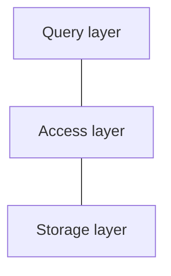

# Requirements

1. **Data Independence**: decouple application from physical
2. **Scalability**: retrieve/access/update arbitrary data efficiently
	- especially: access individual items → restriction
3. **Reliability**: data should survive hw/sw failures

---
# Layer Architecture
simplify/modularize, layers only interact with neighbors
## Simple Layer Architecture

## More Details

---
# Influence of Hardware

---
# Hard disk access

- hard disks still important today -> dbms should consider: sequential access
- speedier disk access: load larger chunks at a time -> **pages**
	- trade-off: TODO
- page structure relevant in: I/O, buffer/memory management, recovery
- still: as much sequential access as possible

---
# Buffer Management

>[!idea] active pages in memory, discard/write back when needed

logging: log first

## Interface

1. `FIX(pageNo, shared)`: allows page to be accessed/modified, optionally exclusively
2. `UNFIX(pageNo, dirty)`: page is free to be discarded/written back

## Buffer Frame

>[!int] like a header, holds relevant info about page

![[Pasted image 20240430155709.png]]

info in header:
- **page number**
- **latch**: r/w lock (shot-term)
- **LSN** (lock sequence number): what was the last change -> to ensure all changes are written
- **state**: clean/dirty/newly created
- **data**: pointer to actual data/actual pages
	- header not in memory bc address drift
	- o_direct

context:
- organized in hash table
- concurrency: mutex in buckets? but others might want to access different pages in the chain. so, we do wild shit
## Buffer Replacement

>[!info] memory full -> replace buffer pages

discard clean, write dirty, replace discarded

![[Pasted image 20240423142844.png|500]]

### Strategies

##### FIFO
- frames in linked list
- ignores locality
- "not as bad as you might think" - but e.g. trees: root often removed, also gets worse with more memory
##### Least Recently Used
- double-linked list (removal in constant time), remove from head
- frames accessed are moved to the end
- very popular
- beware: concurrency - "gets worse as hardware evolves"
- hot-headed 
##### Least Frequently Used
- count number of accesses -> priority-queue
- *conceptually* good, but bad in practice
##### Second Chance

>[!idea] approximate LRU: 1 bit per page, set when page unfixed

- clock algorithm
- go in circles, check for bit, clear during
- easily implemented but crude
##### 2Q

>[!idea] hot pages in LRU, read-once in FIFO

- "not all pages are the same"
- all in FIFO, move into LRU when referenced while in FIFO
- pretty gud

### Hints

>[!idea] DBMS knows more abt read-once pages

- change place in queue: will-need or will-not-need (when unfixing)

---
# Segments

>[!int] set of pages bc most structures span multiple pages

- similar to file/virtual memory - aka we can add/discard pages (no guarantees abt order tho)
- offers **virtual address space** within DBMS: allocate/release, iterate, drop whole segment
- optionally: linear address space, is costly tho
## Implementation
##### Static file mapping  
start + length -> simple but inflexible

![[Pasted image 20240423145701.png|200]]
##### Dynamic extent mapping
pointers to ranges of pages -> best of both worlds: can grow with some overhead

![[Pasted image 20240423145741.png|200]]

- grows exponentially
	- eg factor 2: 
		- block sizes 1, 2, 4, 8, ...
		- to find out what block we're in: $B_{id} =\lfloor\log_{2} x \rfloor$
		- offset into block: $x - (2^{B_{id} - 1})$
		- constant time
- number of extents is bounded -> fits in page
##### Dynamic block-mapping
pointers to single pages -> most flexible but a lot of overhead

![[Pasted image 20240423145809.png|200]]
## Segment Types

- private vs public (visible to user)
- permanent vs temporary (eg user tmp table)
- automatic vs manual
- with vs without recovery (indices don't have to be recovered)
## Standard Segments

| low-level                               | high-level                       |
| --------------------------------------- | -------------------------------- |
| segment inventory, free space inventory | schema, relations, temp segments |
# Update Strategies

**force**: write all
**steal**: take memory

preferred: steal, no force -> complicated tho (dirty data)
# Shadow Paging

>[!int] shadow copy: remember old state of dirty pages

| advantages                | disadvantages                 |
| ------------------------- | ----------------------------- |
| clean data always on disk | complicated page access logic |
| easy recovery             | no more locality              |
| transaction isolation     |                               |
nowadays rarely used
# Delta Files

>[!int] page copied to separate file that is changed in-place

- store clean copy in delta (optimized for commit/assume most changes are committed)
- store dirty data in delta

| advantages                          | disadvantages                            |
| ----------------------------------- | ---------------------------------------- |
| data locality                       | more I/O                                 |
| clean and dirty pages kept separate | either abort or commit becomes expensive |
|                                     | nontrivial: keeping track of delta pages |
