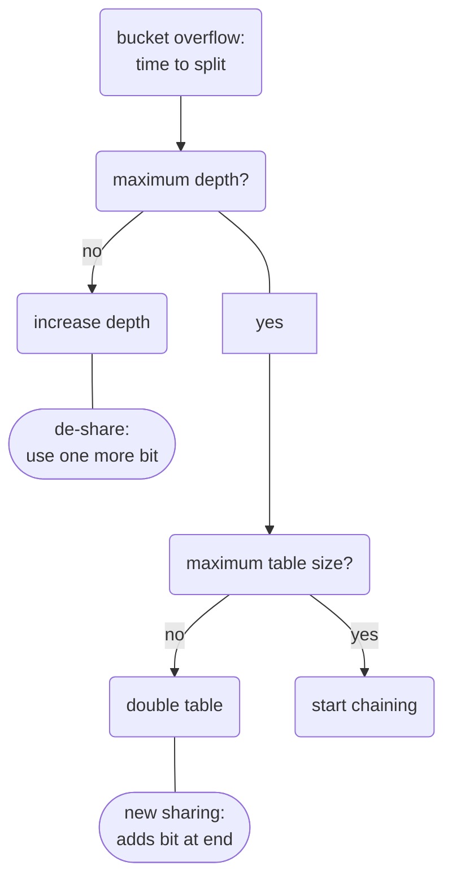

>multiple entries point to same bucket

**depth** ~ how many bits of hash value used?

![[Pasted image 20240725192332.png]]

**load factor**: for balancing chaining vs growth

| Advantages                             | Disadvantages                    |
| -------------------------------------- | -------------------------------- |
| 2 page accesses per lookup             | invasive growth                  |
| growth independent of existing buckets | large steps in space consumption |
| no rehashing                           | collisions...?                   |
