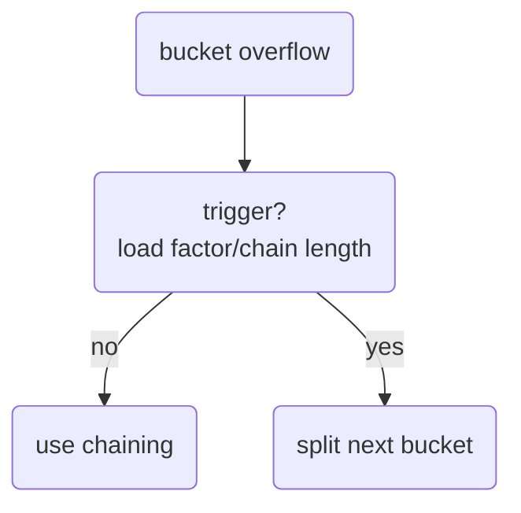

> avoids exponential growth

- order of splits is fixed
- when all buckets are split, cycle starts again

```mermaid
gantt
    dateFormat X
    tickInterval 1day
    section  split
    1   : 0, 1
    ...   : 0, 1
    k-1  : 0, 1
	section not split
	k: 0, 1
	...: 0, 1
	n : 0, 1
	section second halves
	n+1: 0, 1
	...: 0, 1
	n + k - 1: 0, 1
```

| Advantages            | Disadvantages                   |
| --------------------- | ------------------------------- |
| non-disruptive growth | chaining :c                     |
| linear growth         | chains may be there for a while |
| good amortized        | page allocation for directory?  |
