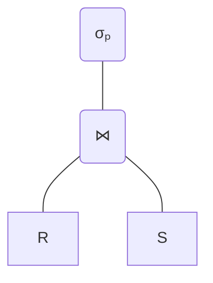
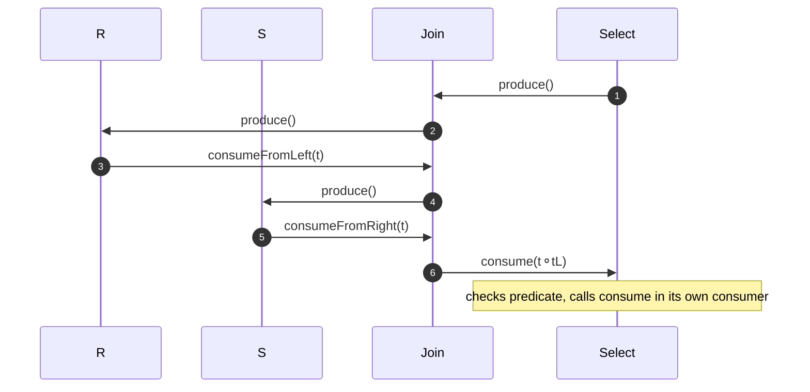

```mermaid
graph BT
	R
	S
	R --- J("⋈")
	S --- J
	J --- P("σₚ")
```

becomes

```mermaid
sequenceDiagram
	autonumber
	participant R as R
	participant S as S
	participant Jo as Join
	participant Sel as Select

	Sel ->> Jo: produce()
	Jo ->> R: produce()
	R ->> Jo: consumeFromLeft(t)
	Jo ->> S: produce()
	S ->> Jo: consumeFromRight(t)
	Jo ->> Sel: consume(t⚬tL)
	Note over Sel: checks predicate, calls consume in its own consumer
```

