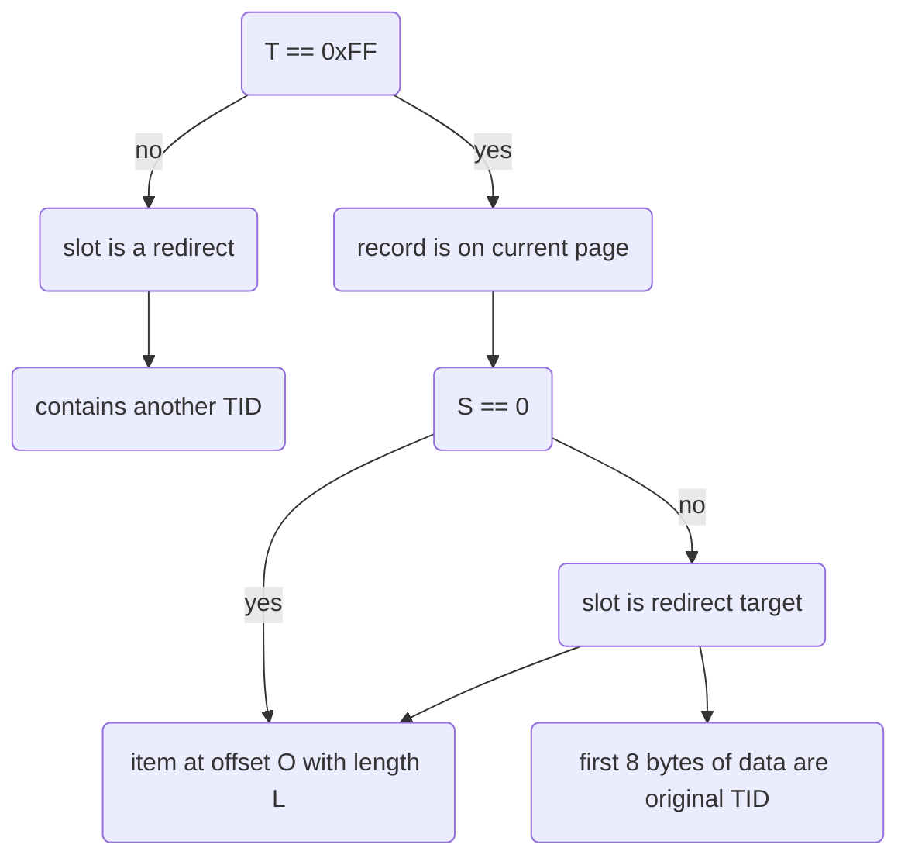

## Header

- LSN for recovery
- slot count
- first free slot (index)
- data start
- free space (after compactification)

----

## Slot

> stores info on where to find data within slotted page

##### TIDs

> used for redirects

interface:
- `get_page_id(segment_id)`
- `get_slot()`

##### Slot implementation

![[Pasted image 20240724173412.png]]

- `T`: marker whether redirect
- `S`: marker whether redirect target
- `O`: offset
- `L`: length

> only 1 lvl of redirects to ensure constant access time and avoid evilshmevil cache misses