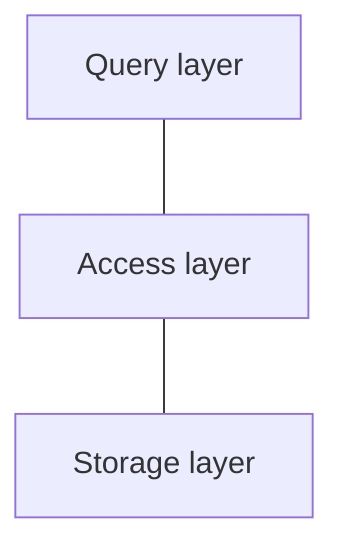

# Requirements

1. **Data Independence**: decouple application from physical
2. **Scalability**: retrieve/access/update arbitrary data efficiently
	- especially: access individual items → restriction
3. **Reliability**: data should survive hw/sw failures

# Layer Architecture
simplify/modularize, layers only interact with neighbors
## Simple Layer Architecture

## More Details

# Influence of Hardware

